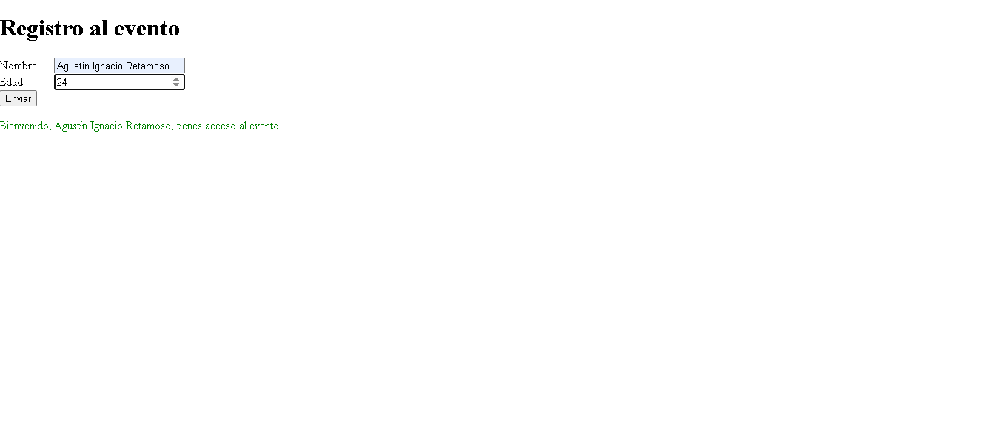

Proyecto REACT - módulo 2

Este proyecto consiste en una página web desarrollada con HTML5, CSS3 y JavaScript
como parte del diplomado Full Stack.
La pagina incluye funciones en JavaScript que interactuan con el DOM, declaracion de variables y demas,
uso de classList.add() y classList.remove() para aplicar clases dinamicamente en los elementes requeridos.

Instrucciones para clonar el repositorio

Entrar: https://github.com/AgustinR3/REACT-1.git

Abrir la carpeta del proyecto.

Ejecutar el archivo index.html en un navegador web.

Nombre: Agustín Ignacio Retamoso

Curso: Diplomado Full Stack

Bibliografía y créditos

W3Schools:
https://www.w3schools.com
